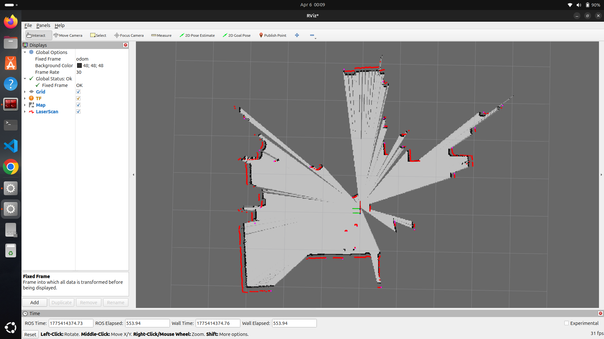

# ROS 2 Localisation & Mapping

Implementation of core autonomous navigation components using ROS 2, including mapping, localization, SLAM, and real-world LiDAR integration.

## Overview

This repository demonstrates the development of a LiDAR-based perception and localization stack for autonomous ground robots.

## The work covers the complete pipeline:

Mapping using known robot poses
Localization using a known map (AMCL)
Simultaneous Localization and Mapping (SLAM)
Real-world mapping using a physical LiDAR sensor

## All components are implemented and validated using ROS 2.

## Implemented Modules
1. Mapping with Known Poses
Generated occupancy grid maps using LiDAR scan data
Used known robot poses to eliminate localization uncertainty
Implemented probabilistic mapping concepts

2. Localization using AMCL (Nav2)
Used a pre-built environment (small_house.world)
Loaded an existing map
Applied Adaptive Monte Carlo Localization (AMCL)
Estimated robot pose using:
Motion model
Sensor model (LiDAR)

3. SLAM using slam_toolbox
Implemented graph-based SLAM
Simultaneously:
Built a map
Localized the robot
Used LiDAR scan matching and pose graph optimization

4. Real-World Mapping with YDLIDAR
Integrated YDLIDAR ROS 2 driver
Published real-time scan data on /scan topic
Generated a map of a real indoor environment
Visualized mapping results in RViz

## 🖼 Real-World Mapping Result


(Mapping performed using YDLIDAR in a real indoor environment)

## 🎥 Demo Videos
## SLAM (slam_toolbox)

[](https://youtu.be/pRJ4cFlJla4)

## Localization using AMCL
🎥 AMCL Localization Demo

[](https://youtu.be/QFtQHtshJbQ)

## 🧠 Key Concepts Demonstrated
Occupancy grid mapping

Probabilistic robotics

Particle filter localization (AMCL)

Graph-based SLAM

LiDAR data processing

Real sensor integration

Simulation → real-world transition

## 🛠 Tech Stack
ROS 2
Nav2 (AMCL)
slam_toolbox
RViz
Gazebo
YDLIDAR

## 📂 Repository Structure (Expected)
src/

 ├── mapping_nodes
 
 ├── localisation_nodes
 
 ├── slam_configs
 
 ├── launch_files
 
 └── rviz_configs

## 🚀 How to Run (General)

Build workspace
```bash
colcon build
source install/setup.bash
```

Run SLAM
```bash
ros2 launch <your_package> slam.launch.py
Run AMCL Localization
ros2 launch <your_package> localisation.launch.py
```
## 📌 Notes

Real-world mapping uses YDLIDAR hardware

AMCL requires a pre-existing map

SLAM builds map and localizes simultaneously

## 🎯 Project Significance

This repository covers the core perception and localization stack required for autonomous vehicles, including:

Mapping
Localization
SLAM
Real sensor deployment

It forms the foundation for higher-level autonomy such as navigation and path planning.

## 🔗 Related Work

This project is part of a larger robotics stack including:

ros2_control-based robot control

Hardware-in-the-loop motor interface

Teleoperation and embedded integration

## ⚡ What Makes This Strong

Covers full AV perception pipeline

Includes both simulation + real sensor data

Demonstrates understanding of probabilistic robotics

Bridges gap between theory and implementation

Just tell me.
